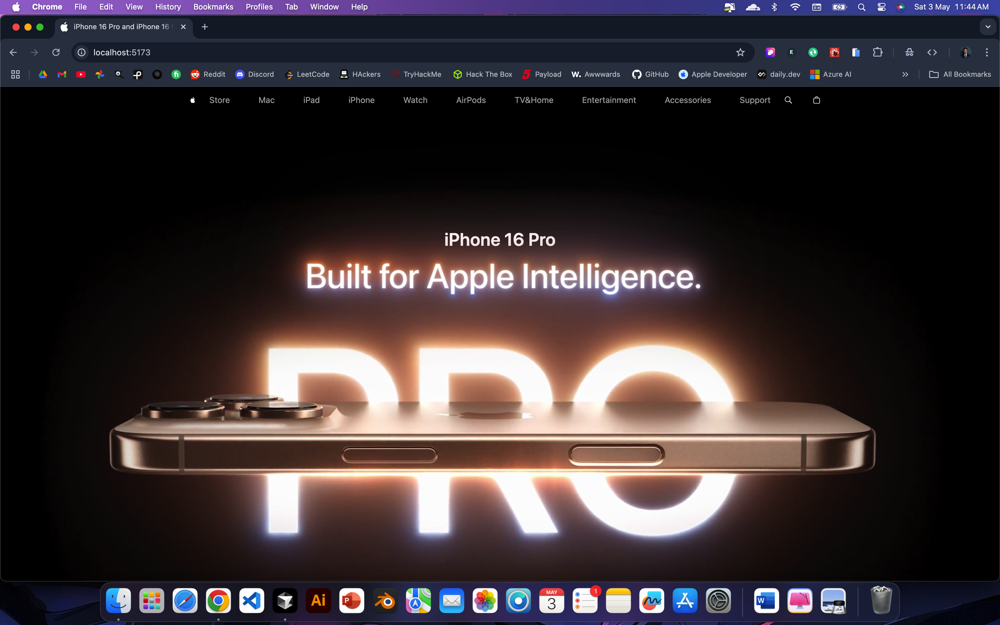

# iPhone 16 Website

This is a modern website showcasing the iPhone 16, built with React, Three.js, and GSAP for smooth animations and 3D effects.

## Demo



## Features

- **3D Models**: Interactive 3D models of the iPhone 16.
- **Smooth Animations**: GSAP-powered animations for a seamless user experience.
- **Responsive Design**: Fully responsive design for all screen sizes.

## Getting Started

To get a local copy up and running, follow these simple steps.

### Prerequisites

- Node.js (v18 or higher)
- npm (v9 or higher)

### Installation

1. Clone the repository
   ```bash
   git clone https://github.com/WaqasIshaque1/iphone-16.git
   ```
2. Navigate to the project directory
   ```bash
   cd iPhone-16
   ```
3. Install dependencies
   ```bash
   npm install
   ```

### Running the Project

To start the development server, run:
```bash
npm run dev
```

Open [http://localhost:5173](http://localhost:5173) in your browser to view the website.

### Building the Project

To build the project for production, run:
```bash
npm run build
```

### Linting

To lint the project, run:
```bash
npm run lint
```

## Technologies Used

- [React](https://reactjs.org/)
- [Three.js](https://threejs.org/)
- [GSAP](https://greensock.com/gsap/)
- [Tailwind CSS](https://tailwindcss.com/)

## License

This project is licensed under the MIT License - see the [LICENSE](LICENSE) file for details.
